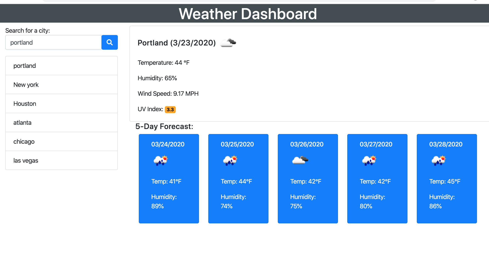

# Weather Dashboard

The weather dashboard is an interactive web application that lets users get the current weather status and the 5 day weather forecast for multiple cities. This application utilizes the AJAX to hook into OpenWeather API to retrieve data in JSON format. Using dynamically updated HTML, CSS, javascript and jQuery. See the deployed web here: <a href="https://bikramshankhar.github.io/Weather-Dashborad/">Weather Dashboard</a>

 